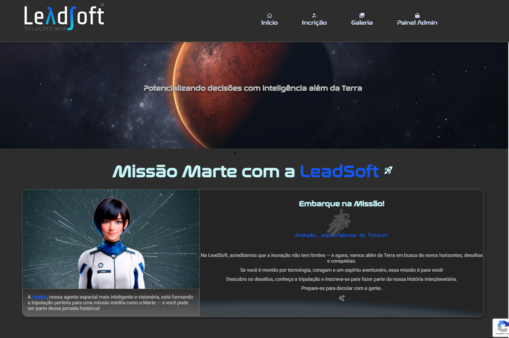
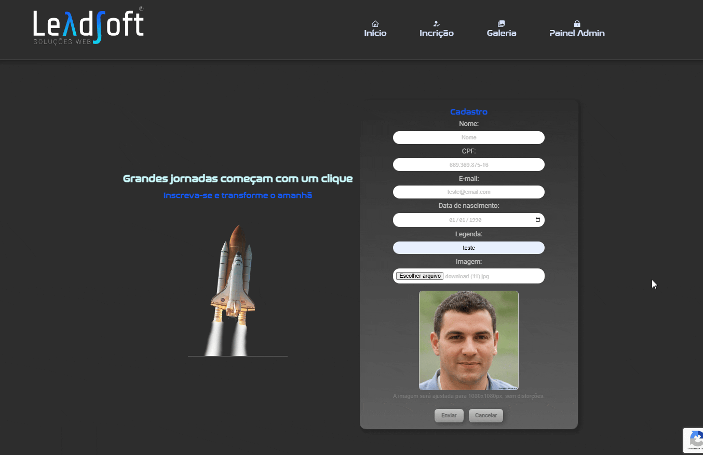
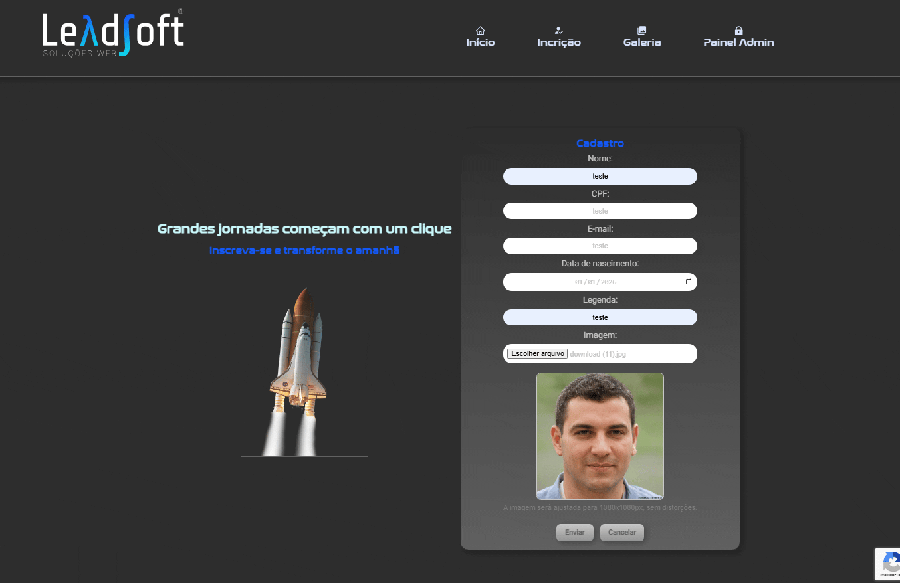
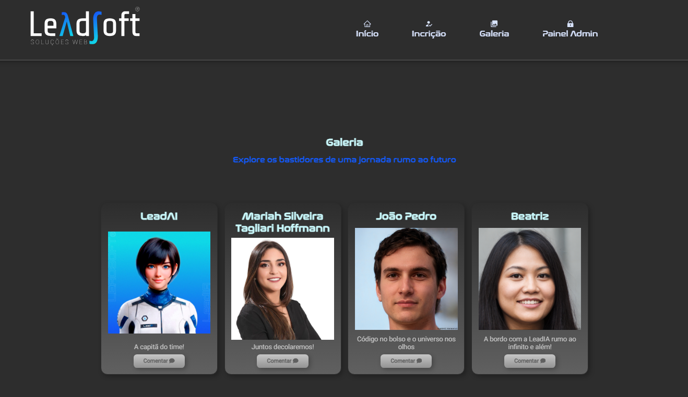
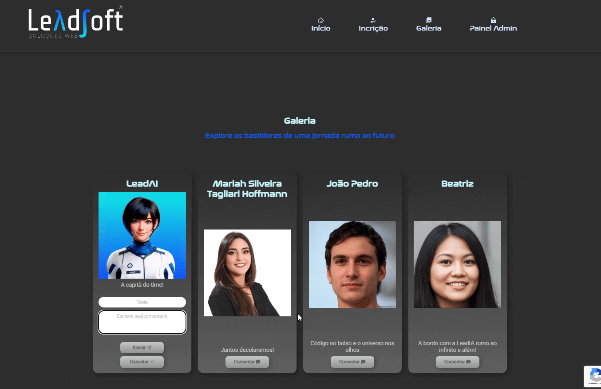
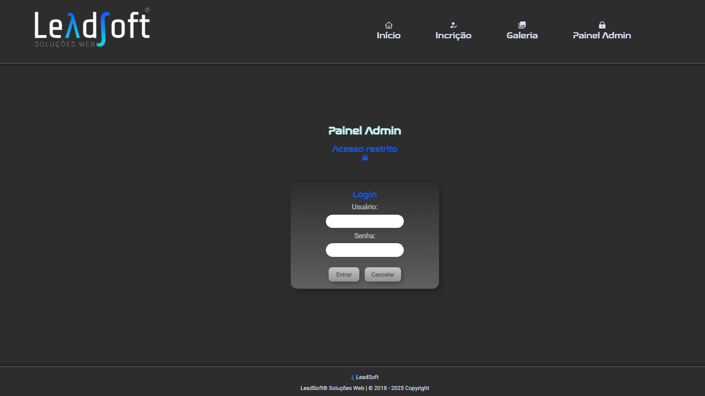
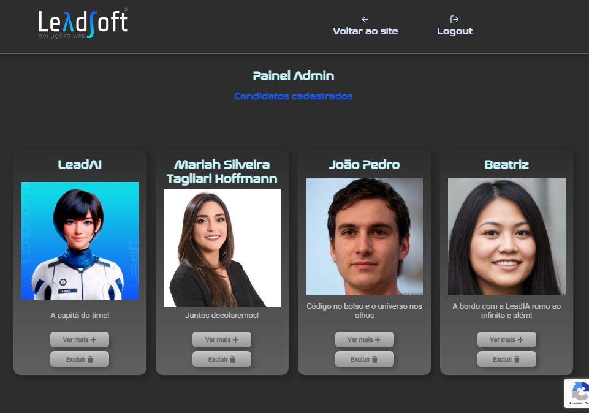
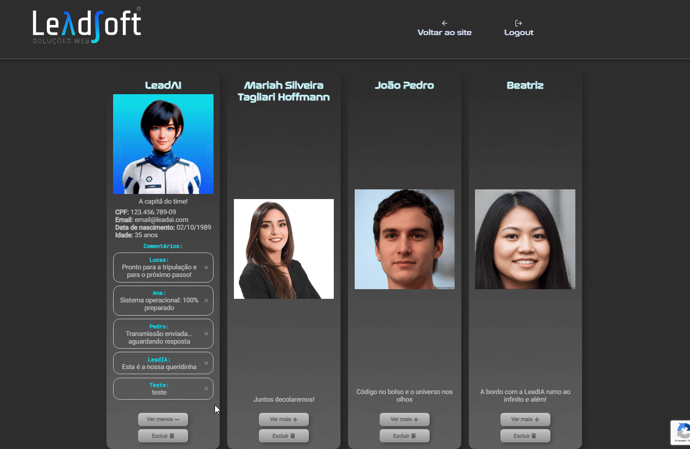
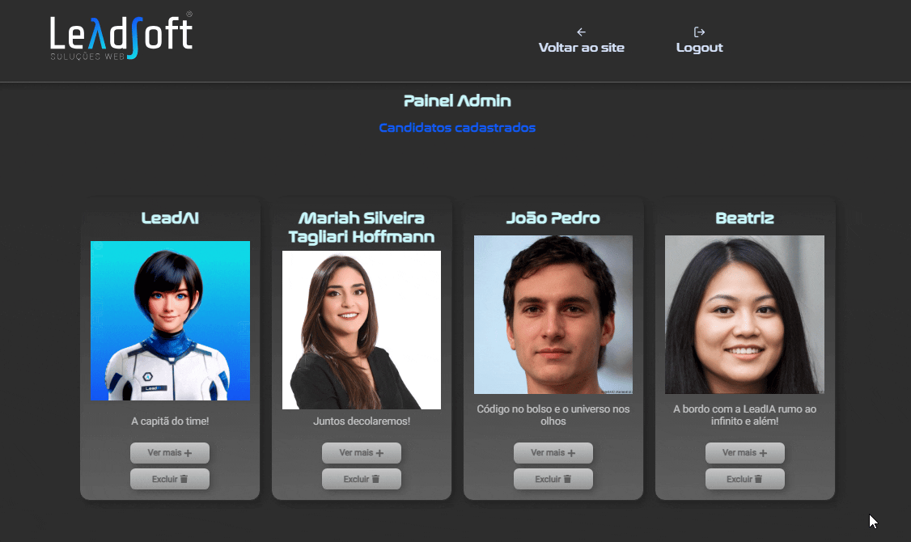

# 🚀 Desafio Full Stack – LeadSoft
Landing Page de inscrição para missão espacial

Este repositório contém a solução para o desafio técnico full stack proposto pela LeadSoft.

🔗 Link do projeto no ar: https://lead-soft-challenge.vercel.app/
## 📑 Índice

- [🚀 Desafio Full Stack – LeadSoft](#-desafio-full-stack--leadsoft)  
- [🔨 Recursos do aplicativo](#-recursos-do-aplicativo) 
- [🛠️ Tecnologias utilizadas](#️-tecnologias-utilizadas)  
  - [Front-end](#front-end)  
  - [Back-end](#back-end)  
- [🧩 Estrutura](#-estrutura) 
- [▶️ Como rodar o projeto localmente](#️-como-rodar-o-projeto-localmente)  
  - [1. Clone o repositório](#1-clone-o-repositório)  
  - [2. Instale as dependências](#2-instale-as-dependências)  
  - [3. Configure as variáveis de ambiente](#3-configure-as-variáveis-de-ambiente)  
  - [4. Adicione o certificado do RavenDB](#4-adicione-o-certificado-do-ravendb)  
  - [5. Rode os servidores](#5-rode-os-servidores)  
  - [6. Acesse a aplicação](#6-acesse-a-aplicação)  
- [🧠 Modelagem de Domínio (DDD)](#-modelagem-de-domínio-ddd)


---
## 🔨 Recursos do aplicativo
- Área pública:  
    - Inscrição de candidatos com validação reCAPTCHA v3   
    
        - Validação de nome, CPF, e-mail, data de nascimento, legenda e imagem  
        
    - Galeria com exibição de candidatos inscritos com nome, foto e legenda 
     
    - Funcionalidade de enviar comentários para candidatos inscritos com validação reCAPTCHA v3 
    
- Área restrita com login e senha de administradores com validação reCAPTCHA v3:  

    - Painel privado com informações de candidatos  
    
    - Opção de deletar comentários  
     
    - Opção de deletar candidatos inscritos  
    
## 🛠️ Tecnologias utilizadas

### Front-end
- Next.js
- React
- Styled Components
- TypeScript
- Axios

### Back-end
- Node.js
- Express
- RavenDB
- DDD + Arquitetura Hexagonal
- reCAPTCHA v3

## 🧩 Estrutura

- `leadsoft-frontend/` – Aplicação Next.js (Landing Page + Galeria)
```bash
leadsoft-frontend/
├── .gitignore
├── package.json
├── tsconfig.json
├── next.config.ts
├── public/
│   └── imagens/                     ← Imagens estáticas acessíveis publicamente
├── src/
│   ├── app/
│   │   ├── page.tsx                 ← Landing page (página pública inicial)
│   │   ├── layout.tsx              ← Layout principal da aplicação
│   │   └── admin/
│   │       └── page.tsx            ← Página protegida para administração
│   ├── components/
│   │   ├── Header.tsx              ← Cabeçalho da página
│   │   ├── Banner.tsx              ← Seção de destaque inicial
│   │   ├── Inicio.tsx              ← Seção de boas-vindas
│   │   ├── Inscricao.tsx           ← Formulário de inscrição
│   │   ├── Galeria.tsx             ← Galeria pública de candidatos
│   │   ├── ItemGaleria.tsx         ← Item individual da galeria
│   │   ├── PainelAdmin.tsx         ← Painel de acesso de administradores
│   │   ├── CampoFormulario.tsx     ← Componente reutilizável para inputs
│   │   ├── ImagePreview.tsx        ← Componente para pré-visualizar imagem
│   │   ├── ProtectedRoute.tsx      ← Proteção de rota para admin
│   │   ├── RecaptchaProviderWrapper.tsx    ← Wrapper para reCAPTCHA
│   │   ├── StyledComponentsRegistry.tsx    ← Suporte ao styled-components no Next.js 13+
│   │   └── Footer.tsx              ← Rodapé da página
│   ├── styles/
│   │   ├── breakPoints.ts          ← Definições de responsividade
│   │   ├── ReusableStyle.ts        ← Estilos reutilizáveis globais
│   │   ├── slideAnimation.ts       ← Animações de entrada com scroll
│   │   └── GlobalStyles.ts         ← Estilos globais com styled-components
│   ├── fonts/
│   │   └── nasalization-rg.otf     ← Fonte personalizada utilizada no projeto
│   ├── hooks/
│   │   ├── useForm.ts              ← Hook para manipulação de formulário
│   │   ├── useInView.ts            ← Hook para detecção de scroll visível
│   │   └── useSlideInOnView.ts     ← Hook para animações com scroll
│   ├── services/
│   │   ├── apiClient.ts            ← Instância Axios configurada
│   │   ├── candidateService.ts     ← Serviços para candidatos (API)
│   │   ├── commentService.ts       ← Serviços para comentários (API)
│   │   ├── inscricaoService.ts     ← Serviço para envio de inscrição
│   │   └── loginService.ts         ← Serviço para login de admin
│   ├── pages/
│   │   └── _document.tsx           ← Configuração base para SSR com styled-components
│   ├── types/
│   │   ├── Candidate.ts            ← Tipagem para dados de candidato
│   │   ├── Comment.ts              ← Tipagem para comentários
│   │   ├── FormFields.ts           ← Tipagem para campos de formulário
│   │   ├── ItemGaleriaTypes.ts     ← Tipagem para item da galeria
│   │   └── ValidationResult.ts     ← Tipagem para validações
│   └── utils/
│       ├── ageCalculator.ts        ← Função para calcular idade
│       ├── formatCpf.ts            ← Função para formatar CPF
│       ├── formatDate.ts           ← Função para formatar data
│       ├── resizeImage.ts          ← Função para redimensionar imagem
│       ├── validadeCPF.ts          ← Validação de CPF
│       ├── validadeEmail.ts        ← Validação de e-mail
│       ├── validadeBirthDate.ts    ← Validação de data de nascimento
│       ├── validadeForm.ts         ← Validação geral de formulário
│       ├── validadeImage.ts        ← Validação de imagem
│       └── validateName.ts         ← Validação de nome
└── middleware.ts                   ← Middleware para proteção de rotas no Next.js
```

- `leadsoft-backend/` – API Node.js com DDD + Arquitetura Hexagonal + RavenDB

```bash
leadsoft-backend/
├── .gitignore                      
├── package.json                  
├── tsconfig.json                  
├── docs/
│   └── ddd-notes.md               ← Notas sobre as decisões de modelagem com DDD
└── src/
    ├── domain/                    ← Camada de domínio puro (regras de negócio isoladas)
    │   ├── entities/              ← Entidades com lógica e validações próprias
    │   │   ├── User.ts            ← Entidade para administrador (login)
    │   │   ├── Comment.ts         ← Entidade que representa um comentário público
    │   │   └── Candidate.ts       ← Entidade que representa um Candidato
    │   ├── repositories/          ← Interfaces de repositórios 
    │   │   ├── CommentRepository.ts    ← Interface para persistência de comentários
    │   │   ├── UserRepository.ts       ← Interface para autenticação/admin
    │   │   └── CandidateRepository.ts  ← Interface para candidatos (CRUD, imagem)
    │   ├── value-objects/         ← Objetos de valor com regras e validações próprias
    │   │   ├── Caption.ts         ← Legenda com limite de caracteres e formatação
    │   │   ├── DateOfBirth.ts     ← Valida formato e idade mínima e máxima
    │   │   ├── Email.ts           ← Validação de e-mail
    │   │   ├── Image.ts           ← Validação tipo e tamanho da imagem
    │   │   ├── Name.ts            ← Nome com validação de caracteres
    │   │   └── CPF.ts             ← CPF com validação e formatação
    │   └── services/
    │       └── RecaptchaVerifier.ts    ← Interface para verificação de reCAPTCHA
    ├── application/
    │   └── use-cases/             ← Casos de uso: orquestram entidades e serviços
    │       ├── RegisterCandidate.ts    ← Cadastro de candidato com validações completas
    │       ├── CommentOnCandidate.ts   ← Adiciona comentário a um candidato
    │       ├── LoginUser.ts            ← Autenticação de administrador com JWT
    │       └── DeleteCandidate.ts      ← Exclui candidato e seus anexos
    ├── infrastructure/                 ← Implementações reais de repositórios e serviços
    │   ├── database/
    │   │   ├── RavenCandidateRepository.ts ← Implementa persistência de candidatos no RavenDB
    │   │   ├── RavenCommentRepository.ts   ← Implementa persistência de comentários no RavenDB
    │   │   └── RavenUserRepository.ts      ← Implementa persistência de admins no RavenDB
    │   ├── config/
    │   │   ├── certificados/
    │   │   │   └── certificado.pfx    ← Certificado de cliente para acessar RavenDB Cloud
    │   │   └── ravenDbConfig.ts       ← Inicializa a conexão com o RavenDB (usando certificado)
    │   └── services/
    │       ├── JwtService.ts               ← Geração e validação de tokens JWT
    │       └── GoogleRecaptchaVerifier.ts  ← Verificação real via API Google reCAPTCHA
    ├── adapters/                  ← Interface com o mundo externo (HTTP)
    │   ├── controllers/           ← Controladores: recebem requisições e executam casos de uso
    │   │   ├── authController.ts       ← Login de administrador (retorna JWT)
    │   │   ├── CommentController.ts    ← Criação e exclusão de comentários
    │   │   └── CandidateController.ts  ← Cadastro, listagem e exclusão de candidatos e imagens
    │   ├── routes/                 ← Define as rotas e associa aos controllers
    │   │   ├── auth.ts             ← Rotas de autenticação (login)
    │   │   ├── commentRoutes.ts    ← Rotas públicas para comentários
    │   │   └── candidateRoutes.ts  ← Rotas públicas e protegidas para candidatos
    │   └── middlewares/
    │       ├── upload.ts          ← Middleware de upload com multer (lida com imagens)
    │       └── authMiddleware.ts  ← Middleware que protege rotas com JWT
    ├── utils/                     ← Funções auxiliares reutilizáveis
    │   ├── captionValidator.ts    ← Valida tamanho da legenda
    │   ├── cpfValidator.ts        ← Verifica se CPF é válido
    │   ├── dateValidator.ts       ← Checa validade da data de nascimento
    │   ├── emailValidator.ts      ← Verifica formato de e-mail
    │   ├── imageValidator.ts      ← Valida tipo e tamanho da imagem
    │   └── nameValidator.ts       ← Verifica caracteres permitidos no nome
    ├── types/
    │   └── express/
    │       └── index.d.ts         ←  Extensão de tipos Express para incluir `req.file` (upload de imagem com multer)
    └── server.ts                  ← Ponto de entrada principal da API (Express app)
```

## ▶️ Como rodar o projeto localmente


### 1. Clone o repositório
```bash
git clone https://github.com/SEU_USUARIO/SEU_REPOSITORIO.git  
cd SEU_REPOSITORIO
```
### 2. Instale as dependências  
```bash
npm install
```
Faça isso em ambas as pastas: /leadsoft-frontend e /leadsoft-backend.

### 3. Configure as variáveis de ambiente

#### 📁 Front-end (/leadsoft-frontend)  
Crie um arquivo .env.local com o seguinte conteúdo:
```bash
NEXT_PUBLIC_API_URL=http://localhost:5000
NEXT_PUBLIC_RECAPTCHA_SITE_KEY=sua-chave-do-recaptcha
```
#### 📁Back-end (/leadsoft-backend)  
Crie um arquivo .env com o seguinte conteúdo:
```bash
PORT=5000
RECAPTCHA_SECRET_KEY=sua-chave-secreta-do-recaptcha
JWT_SECRET=um-segredo-seguro-aqui
RAVEN_URL=https://seu-banco.ravendb.cloud
RAVEN_DATABASE=nome-da-sua-database
RAVEN_CERT_PATH=./config/certificados/seu-certificado.pfx
RAVEN_CERT_PASSWORD=sua-senha-do-certificado
```

### 4. Adicione o certificado do RavenDB

Coloque o certificado de cliente no caminho:
```bash
/leadsoft-backend/config/certificados/
```
### 5. Rode os servidores
#### 📁Back-end (/leadsoft-backend)  
```bash
cd leadsoft-backend  
npm run dev
```
#### 📁 Front-end (/leadsoft-frontend)  
```bash
cd leadsoft-frontend  
npm run dev
```
### 6. Acesse a aplicação
🖥 Front-end: http://localhost:3000

🔧 Back-end: http://localhost:5000


## 🧠 Modelagem de Domínio (DDD)

O back-end do projeto foi estruturado com base nos princípios de Domain Driven Design (DDD), com foco em refletir o domínio da missão LeadIA.

- Linguagem ubíqua alinhada ao enunciado (ex: `Candidato`, `Legenda`, `Galeria`, `Painel`)
- Casos de uso bem definidos na camada de aplicação
- Separação clara entre domínio, infraestrutura e adaptadores (Arquitetura Hexagonal)
- Estilo de código voltado à clareza e compreensão do problema

Mais detalhes sobre as decisões de modelagem estão no arquivo [`leadsoft-backend/docs/ddd-notes.md`](./leadsoft-backend/docs/ddd-notes.md)
